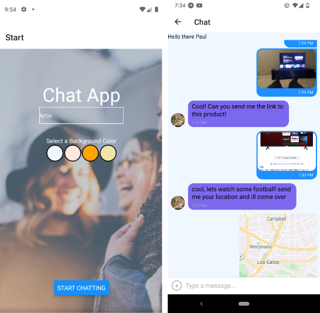

<h1>Achievement 5 Project: React Native Mobile Chat App</h1>

 
<h1>Objective</h1>

To build a chat app for mobile devices using React Native. The app will
provide users with a chat interface and options to share images and their
location.

 
<h1>Key Features</h1>

  <ul>
    <li>A page where users can enter their name and choose a background color for the chat screen before joining the chat.</li>
    <li>A page displaying the conversation, as well as an input field and submit button.</li>
    <li>The chat must provide users with two additional communication features: sending images and location data.</li>
    <li>Data gets stored online and offline.</li>
</ul>

<h1>Getting Started</h1>
<h3>Set up a Firestore Database.</h3>

Click on the Get Started button on the homepage, then click on Create Project (or Add project if you’ve created Firebase projects before). A form will appear asking you to fill in basic information about your new project. You need to create a database, so click Develop from the menu on the left-hand side and, from the additional menu that appears, select Cloud Firestore, then select Create Database. You can begin to create your collection and documents. You will need to replace the firebaseConfig variable in Chat.js with your own database configuration.

<h3>Set up Expo.</h3>

To create new projects and start running Expo, you’ll need to install the Expo Command Line Interface (CLI) on your machine. To do so, open up your terminal and type in the following command: npm install expo-cli --global
 
Now, you need an Expo account. Head over to the Expo signup page and follow the instructions to create an account. Once that’s done, you should be able to log in to Expo from your browser and mobile app. Create a new Expo project by entering: expo init [project name]
 
Make sure that your phone and computer are on the same network (LAN or WiFi) and open up the Expo app on your phone. See if your new project is listed under “Recently in Development.” If your project isn’t listed, scan the QR Code provided in your browser (or your terminal) using the Expo Client app for Android or the built-in QR code scanner of your iPhone camera.

<h1>Key Features</h1>

  <ul>
    <li>expo</li>
    <li>firebase</li>
    <li>netinfo</li>
    <li>prop-types</li>
    <li>react</li>
    <li>react-native</li>
    <li>react-native-async-storage</li>
    <li>react-native-gifted-chat</li>
    <li>react-native-maps</li>
</ul>

